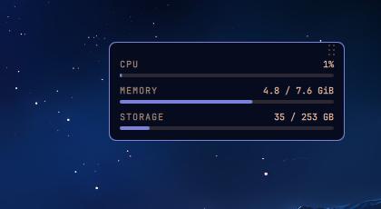

# HW Monitor

A small desktop widget for [Omarchy](https://omarchy.org/) that shows the three
numbers you actually check: CPU, memory, and storage.

It sits on the desktop, below your windows, so it is there when you clear the
screen and out of the way when you do not. It follows your Omarchy theme, so it
looks like the rest of the desktop without any configuration.



## What it does

- **CPU, memory and storage** as labelled bars, refreshed every 3 seconds.
- **Drag it anywhere.** Grab the dotted handle at the top right. Where you drop
  it is remembered across restarts.
- **Click a storage bar** to open that drive in Files.
- **USB sticks and external drives show up on their own.** Anything mounted
  under `/run/media`, `/media` or `/mnt` gets its own labelled row, and its own
  click target. Unplug it and the row goes away.

No configuration file, no daemon, no extra packages.

## Install

```bash
omarchy plugin add https://github.com/albertojb/omarchy-hw-monitor.git --enable
omarchy restart shell
```

To remove it:

```bash
omarchy plugin remove albertojb.hwmonitor
omarchy restart shell
```

The widget stores one thing outside its own directory: the position you dragged
it to, in `~/.local/state/omarchy/albertojb-hwmonitor-position`. Nothing else in
your configuration is read or written.

## Notes

The widget's layer surface covers the screen so that dragging stays stable, but
its input region is masked to the card itself - the rest of your desktop stays
clickable. It renders below windows, never on top of them.

Storage numbers come from `lsblk`, memory from `/proc/meminfo`, and CPU from two
samples of `/proc/stat` taken 300 ms apart.

If you edit `HwMonitor.qml`, run `omarchy restart shell` to see the change.

## Requirements

- Omarchy 4.x with the Quickshell-based shell
- `jq`, `lsblk` (both standard on Omarchy)
- `nautilus` for the click-to-open action

Tested on Omarchy 4.0.1.

## License

MIT
